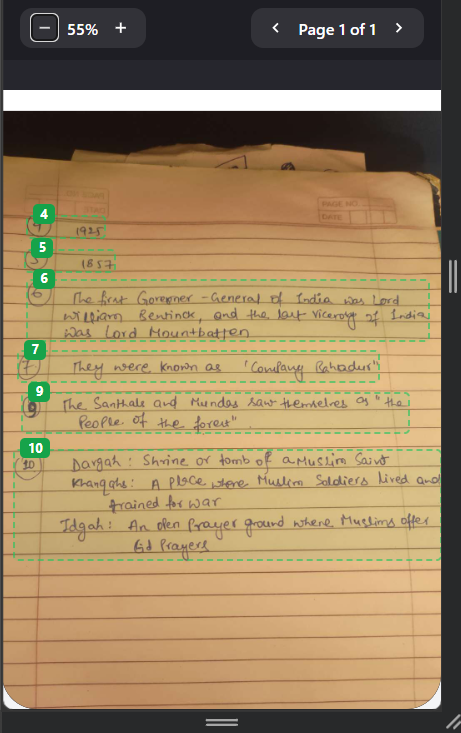

# 🎓 VedaAI - Automated Exam Grading & Handwritten Answer Mapping

> An end-to-end AI-powered document intelligence system that extracts printed exam questions, isolates student handwritten answers using 2D spatial grounding, maps responses to questions, performs automated grading, and renders interactive annotated answer sheets.

🔗 **Live Deployment**: [https://veda-ai-assignment-iota.vercel.app/](https://veda-ai-assignment-iota.vercel.app/)

---

## 📸 Application Screenshots

### 1. Document Upload Screen


### 2. Live Graded Answer Sheet with 2D Spatial Grounding & Score Stamps


---

## ✨ Key Features & Capabilities

- 📄 **Printed Question Extraction**: Concurrently extracts exam questions, sub-parts, full text, and maximum marks directly from PDF question papers.
- ✍️ **Handwritten Answer Localization**: Detects handwritten responses with exact 2D spatial bounding box coordinates `[ymin, xmin, ymax, xmax]` normalized on a 0–1000 scale.
- 🎯 **3-Pass Intelligent Mapping**: Matches answers to questions via direct label matching, fuzzy text matching, and semantic LLM reasoning.
- 🔴🟢 **Color-Coded Visual Evaluation**:
  - **Green Box (`#16a34a`)**: Full marks awarded.
  - **Orange Box (`#d97706`)**: Partial marks awarded.
  - **Red Box (`#dc2626`)**: Incorrect response (0 marks).
- 🏷️ **Teacher Handwritten Score Annotations**: Shows question scores (e.g., `0/2`, `2/3`, `5/5`) stamped directly over handwritten answer blocks.
- 📊 **Overall Marks Summary**: Automatically tallies total earned score vs total exam marks (e.g. `Total = 18 / 30`) stamped at the bottom of the answer sheet.
- 📥 **PDF Export**: Download the complete graded answer sheet with high-resolution annotations and teacher marks as a PDF file.
- 🔍 **Interactive Canvas & Responsive UI**: Smooth zooming (50% to 250%), auto-scrolls to answers upon clicking questions, and adapts to desktop and mobile screens.
- 🔑 **Multi-Key Failover & Gemini Model Selection**: Round-robin API key pool across multiple Gemini keys (`GEMINI_API_KEY1`, `KEY2`, `KEY3`) with instant failover on 429 quota limits.

---

## 🛠️ Architecture & Tech Stack

- **Frontend**: React, Vite, CSS Modules / Custom Design System, jsPDF, Framer-inspired UI
- **Backend**: FastAPI, Python 3.10+, PyMuPDF (`fitz`), Pillow, Google Generative AI Python SDK
- **AI Models**: Google Gemini Vision (`gemini-3.7-flash`, `gemini-3.6-flash`, `gemini-3.5-flash`)

---

## 🚀 Getting Started

### Backend Setup
```bash
cd backend
python -m venv venv
.\venv\Scripts\activate      # On Windows
source venv/bin/activate    # On Linux/macOS
pip install -r requirements.txt
uvicorn main:app --reload --host 0.0.0.0 --port 8000
```

### Frontend Setup
```bash
cd frontend
npm install
npm run dev
```

---

## ⚙️ Configuration (`backend/.env`)

```env
GEMINI_API_KEY1=your_gemini_api_key_1
GEMINI_API_KEY2=your_gemini_api_key_2
GEMINI_API_KEY3=your_gemini_api_key_3
GEMINI_MODEL=gemini-3.7-flash
API_BEARER_TOKEN=aman-secret
```

---

## ⚠️ Known Limitations & Notes

1. **Page Limit**: Optimized for **1 to 2 pages** per upload session for fast parallel processing and rate-limit preservation.
2. **Slot Specificity**: Files must be uploaded to their designated slots (Question Paper in Question slot, Answer Sheet in Answer slot). Swapping them will prevent accurate question-to-answer evaluation.
3. **Legibility**: Extremely faint, skewed, or low-contrast handwritten images may experience lower spatial bounding box accuracy.
