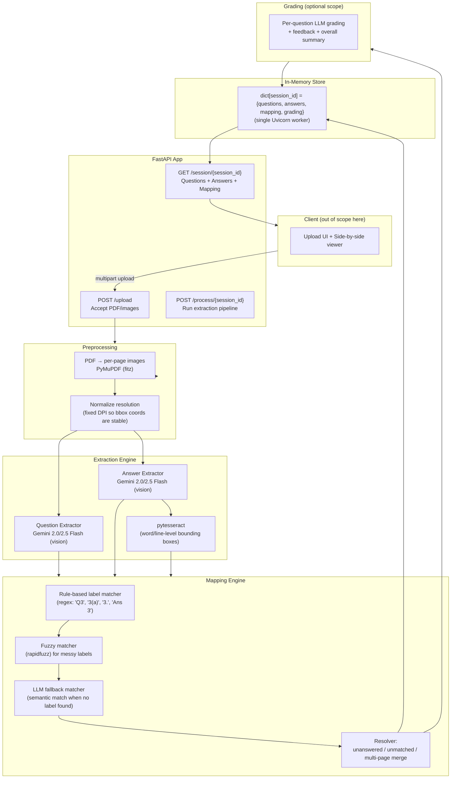
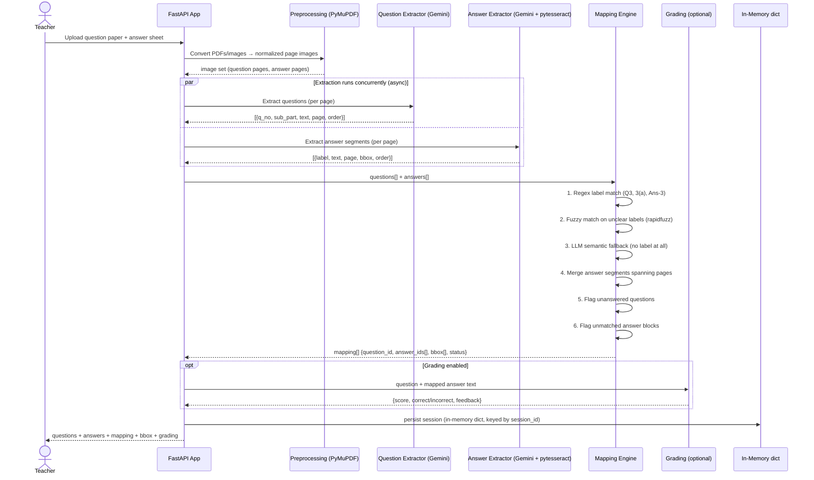

# AI Assessment Extraction & Answer Mapping — Backend Design

> Scope note: backend only — upload handling, extraction, mapping, highlighting data, optional grading. No frontend/UI design decisions here.
> Stack: **FastAPI (Python)**.

---

## 1. High-Level Architecture



---

## 2. Processing Flow (Sequence)



---

## 3. Backend Directory Structure

```
assessment-mapper/
├── main.py                        # FastAPI app entrypoint, route registration
├── requirements.txt
├── Dockerfile                     # installs tesseract-ocr system package
│
├── routers/
│   ├── upload.py                  # POST /upload
│   ├── process.py                 # POST /process/{session_id}
│   └── session.py                 # GET /session/{session_id}
│
├── services/
│   ├── preprocessing/
│   │   ├── pdf_to_images.py       # PyMuPDF: PDF → page images (fixed DPI)
│   │   └── image_normalize.py     # resize/orient consistently
│   │
│   ├── extraction/
│   │   ├── question_extractor.py  # Gemini call + JSON schema for questions
│   │   ├── answer_extractor.py    # Gemini call + JSON schema for answers
│   │   └── ocr_bbox.py            # pytesseract word/line bounding boxes
│   │
│   ├── mapping/
│   │   ├── label_parser.py        # regex label extraction ("Q3", "3(a)")
│   │   ├── fuzzy_match.py         # rapidfuzz-based matching
│   │   ├── llm_fallback_match.py  # semantic match when no label present
│   │   └── resolver.py            # final mapping + edge-case flags
│   │
│   └── grading/
│       └── grade_answer.py        # optional LLM grading + feedback
│
├── models/
│   └── schema.py                  # Pydantic models: Question, AnswerSegment, Mapping
│
├── store/
│   └── memory_store.py            # in-memory dict, session TTL cleanup
│
└── .env.example                   # GEMINI_API_KEY
```

---

## 4. Backend Tech Stack Reference

| Layer | Tech | Role | Why this one |
|---|---|---|---|
| **API framework** | **FastAPI** | Upload, process, fetch endpoints | Async-native (good for concurrent Gemini calls), Pydantic built in, auto-generated OpenAPI docs for free |
| **ASGI server** | Uvicorn (`--workers 1`) | Serve the app | Single worker is a deliberate choice — see §6, in-memory store note |
| **File upload** | FastAPI's `UploadFile` (`python-multipart`) | Accept PDF/image files | Native, no extra library needed |
| **PDF → image** | **PyMuPDF** (`fitz`) | Rasterize pages at fixed DPI | Fast, gives exact page pixel dimensions needed for stable bbox coordinates |
| **Vision/LLM extraction** | **Google Gemini 2.0 Flash / 2.5 Flash** (`google-generativeai`, free tier) | Read question paper + handwritten answers, return structured JSON | Multimodal, strong handwriting reading, generous free quota, native JSON mode |
| **Precise bounding boxes** | `pytesseract` (wraps Tesseract OCR engine) | Word/line-level coordinates | LLMs read text well but aren't pixel-precise on coordinates — pair with real OCR and align via fuzzy match |
| **Fuzzy text matching** | `rapidfuzz` | Match OCR line text to LLM-extracted answer text; match messy question labels | Fast, pure-Python-friendly, no external service |
| **Data validation** | **Pydantic** | Question / AnswerSegment / Mapping models | Free request/response validation, matches FastAPI natively |
| **In-memory storage** | Plain `dict`, keyed by `session_id`, TTL cleanup via background task | No DB required per assignment constraints | — |
| **Deployment** | **Render or Railway** (not Vercel) | Live URL requirement | Both allow a Dockerfile / system package install for `tesseract-ocr`, which Vercel's Python runtime does not support |

---

## 5. Core Data Model (Pydantic)

```python
from pydantic import BaseModel
from typing import Optional, Literal

class Question(BaseModel):
    id: str
    number: str            # "11"
    sub_part: Optional[str] = None   # "a" | "b" | None
    text: str
    page: int
    order: int              # printed order index

class BBox(BaseModel):
    x: float
    y: float
    w: float
    h: float                # normalized 0–1, relative to page image

class AnswerSegment(BaseModel):
    id: str
    label: Optional[str] = None   # raw label student wrote, e.g. "Q3"; None if absent
    text: str
    page: int
    bbox: BBox
    order: int               # order student wrote it in

class Mapping(BaseModel):
    question_id: str
    answer_segment_ids: list[str]   # supports multi-page answers; empty = unanswered
    match_type: Literal["label", "fuzzy", "llm_semantic", "none"]
    status: Literal["answered", "unanswered", "unmatched_extra"]
```

`unmatched_extra` answer segments (answers with no corresponding question) are kept as a **separate list**, not discarded — this is one of the explicit edge cases graders check for.

---

## 6. Edge Cases & FastAPI-Specific Notes

| Case | Handling |
|---|---|
| Sub-parts (11a, 11b) | Question extractor prompt explicitly instructs: treat labelled sub-parts as separate entries, preserve original numbering string as-is |
| Out-of-order answers | Mapping is label-driven, not position-driven — `order` is stored but never used for matching |
| Unanswered questions | Any question with no matched answer segment → `status: "unanswered"` |
| Unmatched answers | Any answer segment that fails label/fuzzy/LLM match → kept in `unmatched_extra` list |
| Multi-page answers | Resolver merges consecutive segments carrying the same resolved label across pages into one `answer_segment_ids[]` |
| **Tesseract system dependency** | `pytesseract` needs the `tesseract-ocr` binary installed at OS level — add it in the Dockerfile (`apt-get install -y tesseract-ocr`), not just `pip install pytesseract` |
| **In-memory store + scaling** | Run Uvicorn with `--workers 1` — a `dict` in process memory is invisible to other worker processes; this is fine at assignment scale but is a deliberate constraint, not an oversight |
| **CORS** | Only needed if the frontend is deployed on a different origin than the FastAPI backend — add `CORSMiddleware` in that case |
